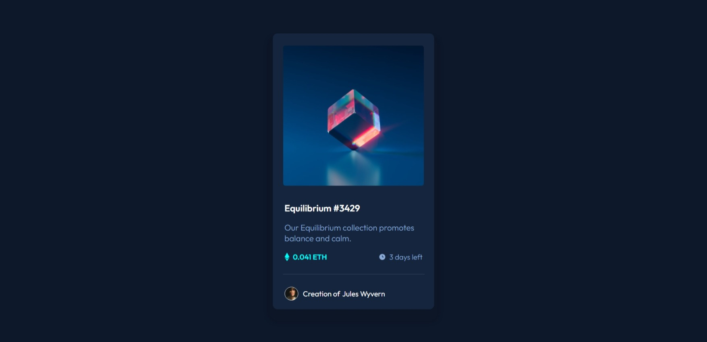

# Frontend Mentor - NFT preview card component solution

This is a solution to the [NFT preview card component challenge on Frontend Mentor](https://www.frontendmentor.io/challenges/nft-preview-card-component-SbdUL_w0U). Frontend Mentor challenges help you improve your coding skills by building realistic projects. 

## Table of contents

- [Overview](#overview)
  - [The challenge](#the-challenge)
  - [Screenshot](#screenshot)
- [My process](#my-process)
  - [Built with](#built-with)
  - [What I learned](#what-i-learned)
  - [Continued development](#continued-development)
- [Author](#author)
- [Acknowledgments](#acknowledgments)

**Note: Delete this note and update the table of contents based on what sections you keep.**

## Overview

### The challenge

Users should be able to:

- View the optimal layout depending on their device's screen size
- See hover states for interactive elements

### Screenshot

## My process

- I created the HTML layout for the component based on the challenge requirements.
- I created the CSS styles for the component based on the challenge requirements.
- Then I added Flexbox to the CSS styles to make it responsive.
- Then I added various hover states to the component.
- Then I added variables.
- Then I added the component to the project.

### Built with

- Semantic HTML5 markup
- CSS custom properties
- Flexbox
- Mobile-first workflow
- Sweat and blood.

### What I learned

- Flexbox
- ::before
- ::after
- Better CSS variable naming

### Continued development

I want to work more on my CSS and implementation of Flexbox.

## Author

Ish Kapoor
- Website - [Ish Kapoor](https://beacons.ai/ishkapoor)
- Frontend Mentor - [@yourusername](https://www.frontendmentor.io/profile/ishkapoor2000)
- Twitter - [@ishkapoor9](https://www.twitter.com/ishkapoor9)

## Acknowledgments

I did it all on my own. Like a KING.